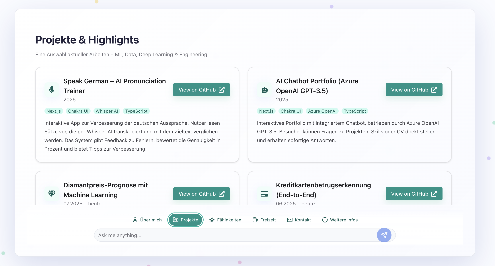

# 🌐 AI Portfolio

An interactive portfolio built with Next.js 15.4.6, showcasing AI, ML, and software engineering projects.
The portfolio includes an integrated AI chatbot (powered by Azure OpenAI GPT-3.5)

## 🚀 Features

- ⚡ **Next.js 15.4.6** – App Router, API routes, server components
- 🎨 **Chakra UI** – Responsive and modern UI design
- 🤖 **AI Chatbot Integration** – Powered by Azure OpenAI GPT-3.5
- 📱 **Responsive Design** – Works across desktop, tablet, and mobile

## 📂 Project Structure
```
my-ai-portfolio/
├── src/
│   ├── components/      # UI components
│   ├── sections/        # Page sections (About, Projects, Skills, etc.)
│   ├── app/             # Next.js App Router
│   └── constants/       # Static data
├── public/              # Static assets
├── package.json
└── README.md
```

## 🛠️ Tech Stack

- **Frontend:** Next.js 15.4.6, TypeScript, Chakra UI
- **AI/ML:** Azure OpenAI GPT-3.5
- **Backend:** Next.js API Routes
- **Deployment:** Vercel

## 🔑 Getting Started

1. **Clone the repository**
   ```bash
   git clone https://github.com/quocvietphung/my-ai-portfolio.git
   cd my-ai-portfolio
   ```
2. **Install dependencies**
   ```bash
   npm install
   # or
   yarn install
   ```
3. **Set up environment variables**

   Create a `.env.local` file:
   ```env
   AZURE_OPENAI_API_KEY=your_api_key
   AZURE_OPENAI_ENDPOINT=https://your-endpoint.openai.azure.com/
   ```
4. **Run locally**
   ```bash
   npm run dev
   ```

   Visit: [http://localhost:3000](http://localhost:3000)

## 📸 Screenshots

### About Section – Personal introduction
### Projects Section – AI & ML project highlights
### AI Chatbot – Interactive assistant within the portfolio

#### Demo Screenshot


## 📜 License

MIT License. Feel free to use and adapt this portfolio.
